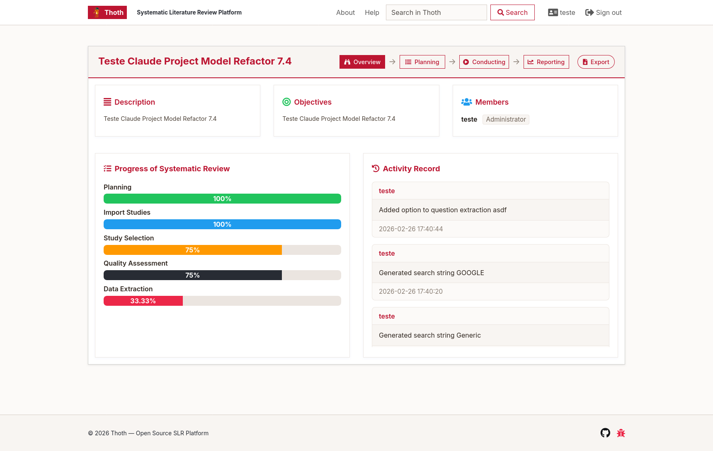

# Thoth: Systematic Literature Review Platform [](https://github.com/ProjetoESE/Thoth)

## Screenshot

<p align="center">
   
</p>

<p align="center"><em>Example of the Thoth project dashboard and progress tracking interface.</em></p>

**Legacy Version**

> **Notice:** This repository contains the legacy version of Thoth, intended primarily for educational, experimental, and archival purposes. For production use and the latest features, please visit [Thoth 2.0](https://thoth-slr.com/).

This project is a refactored version of the original Thoth software, maintained for historical interest and community contributions. It is **not recommended for use in real-world or mission-critical projects**.


---

## License

This project is licensed under the MIT License. See [LICENSE.txt](license.txt) for details.


## Getting Started (Docker)

Follow these steps to set up and run Thoth locally using Docker:

## Running Locally with Docker

1. **Clone the repository:**

   ```sh
   git clone https://github.com/unipampa-lesse/thoth-legacy.git
   cd thoth-legacy
   ```

2. **Copy and configure application settings:**

   ```sh
   cp application/config/database_sample.php application/config/database.php
   cp application/config/config_sample.php application/config/config.php
   # (Optional) Edit these files to adjust database credentials or other settings
   ```

3. **Build and start the containers:**

   ```sh
   docker compose up --build
   ```

   - The app will be available at [http://localhost:8080](http://localhost:8080)

4. **Initialize the database:**

   ```sh
   docker exec -i <mysql_container_name> mysql -uthoth -pthoth thoth < docs/database/thoth.sql
   ```

   Replace `<mysql_container_name>` with the actual name (e.g., `thoth-db-1`).

5. **Create and set permissions for the sessions directory:**
   If you encounter errors related to session save path or permissions, run:

   ```sh
   mkdir -p application/cache/sessions
   chmod 777 application/cache/sessions
   ```

   This ensures PHP can write session files.

6. **Default credentials:**
   - Check your database seed or ask your admin for the default login.

7. **Stopping the app:**

   ```sh
   docker compose down -v
   ```

---

## Contributing

Contributions are welcome! Please see [contributing.md](contributing.md) for guidelines.

## Contact

For questions or support, please open an issue on the [GitHub repository](https://github.com/unipampa-lesse/thoth-legacy).

